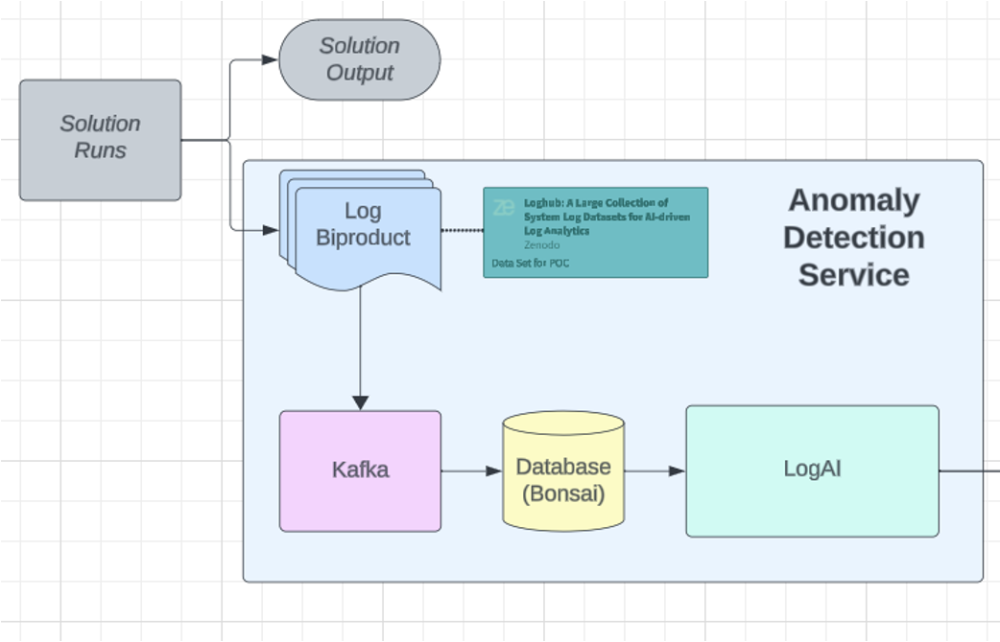

## Kafka OpenSearch Pipeline

My contribution to a log anomaly detection service project: full repo found [here](https://github.com/aminoa/log-anomalies), and this portion of the project can be found in the [pipeline](https://github.com/aminoa/log-anomalies/tree/main/pipeline) subfolder. This is a prototype pipeline in which a client's log files are sent to a Kafka cluster in order to decouple the log source from our intermediate datastore, largely removing any restrictions on the technology clients can use to produce and store their log files. The Kafka producer formats the client's log as a JSON string before compressing it and sending it to an [Upstash](https://upstash.com/) cluster. Producer messages are also batched to optimize throughput. The Kafka consumer then polls for the JSON string messages and creates an Open Search record for uploading to a [Bonsai](https://bonsai.io/) OpenSearch instance. This is also done in batches for further throughput improvement, and the Time field is indexed for query optimization. From the DB, the analytics team can access log files updated in realtime in order to produce their anomaly report. The pipeline design is highly scalable, resilient, and offers extremely flexible integration for diverse client log schema and sources.
  

  
This repo contains a gradle project with 4 classes:
[BonsaiConfig](#BonsaiConfig), [KafkaConfig](#KafkaConfig), [HealthAppProducer](#HealthAppProducer), and [HealthAppConsumer](#HealthAppConsumer). 
The purpose of the project is to send health app log entries to a Kafka cluster
using the HealthAppProducer class, and then process the messages
and insert them into a Bonsai Open Search database using the HealthAppConsumer class.

### BonsaiConfig

Parses a text file containing Bonsai credentials,
used for avoiding exposing secrets in plain text. Stores credentials as a private attribute

### KafkaConfig

similar to BonsaiConfig, parses a Kafka config file and stores
secrets in private attributes to avoid exposing them in plain text.

### HealthAppProducer

Contains two private attributes: a log object, and a string
of arrays that includes all fields from the health app log files.

The createKafkaProducer method takes a config filepath and configures and returns a Kafka producer.
It first reads in the Kafka credentials using the KafkaConfig class
and uses them to establish a connection with our Upstash.io Kafka cluster.
Both key and values serializers are set as Strings, and the producer is then
configured to compress and batch messages to optimize throughput. The messages
are compressed using the snappy algorithm, which has historically been championed
by Kafka, though LZ4 would be an equally appropriate choice. “LINGER_MS_CONFIG”
is set to 20, so that message batches are only sent every 20ms, and the batch size
increased to 32kb so that the producer batches messages targeting the same partition
by default. A null key is used so that the messages are sent round robin, which further
optimizes throughput. There is no need to use keys to preserve any relative order, as the timestamps
are assumed to be accurate.

The main method first initializes variables representing the config filepaths and the
topic which the producer will write to. A producer is then initialized using the
createKafkaProducer method described above. A log file is read in to simulate an API call
that would read streaming log information in an enterprise program. Each entry is used
to initialize a JSON object. Note that about a dozen entries out of over 250k included
extra fields, and these are ignored in this case as such a small number of affected entries
would not have a significant impact on the logAI models. The log JSON object is then used
to initialize a producer record, which is sent to the Kafka cluster. The onCompletion method
is overridden to log record data on successful sends, as well as to log any failures. The producer
is closed in a finally block in order to ensure that it is correctly flushed and shut down.

### HealthAppConsumer 

The consumer contains one private attribute, a log object, and three private methods.

The method createOpenSearchClient takes a Bonsai config filepath and returns a
Bonsai REST client. The BonsaiConfig class is used to parse a bonsai URI credential
and use those credentials to set up the client.

The method createKafkaConsumer takes a config filepath and a Kafka consumer group ID, 
and returns a Kafka consumer. Similar to createKafkaConsumer, it uses the KafkaConfig class
to read in Kafka credentials and establish a connection with our Upstash.io Kafka cluster.
It sets the consumer's group ID to guarantee sequential offset reads, and is currently set
to read an offset reset at earliest, which will read all messages from a given partition if an
offset has not been set. This will guarantee that every message is read at least once, and if they 
are read multiple times the ID will ensure duplicate records are not produced in the Bonsai
database, as further explained in the main method section.

The method getOrCreateIndex will create an index if it does not already exist in the Bonsai database,
and if the index already exists will simply log the fact that it already exists. This is largely a convenience
function for experimenting with the database. Note that Open Search mapping was created through the
Bonsai UI, and that it indexes the Time field so that logs can be easily and efficiently queried by
time slice.

The main method first initializes variables representing the config filepaths
and the topic which the consumer will subscribe to, as well as the group ID and the
name of the Bonsai Index (note that 'index' in Open Search represents what is generally referred
to as a 'collection' in NoSQL DBs such as MongoDB or GCP Firestore). An open search client
and a consumer object are initialized using createOpenSearchClient and createKafkaConsumer,
respectively. The index is then created or logged, and a graceful shutdown hook is
created in lines 104-115. This ensures that the consumer will correctly commit offsets
even in the case of an interruption or other exception. The consumer then subscribes to
the indicated topic and begins to poll.

Each consumer polls every 3 seconds to allow the producer to send a sizeable
batch to the cluster, thereby optimizing throughput. In practice, this led to
about 500 records being written to the DB in bulk on each Kafka consumer poll, allowing
for reduced latency on the network from the Kafka cluster to the Bonsai DB, as
well as optimized concurrent writes within the DB itself.

Before uploading the messages to the Bonsai DB, each message is assigned a unique
identifier based on its topic, partition, and offset to avoid duplicates when
reprocessing the same message twice. Though it would be preferable to produce
an ID from the log entries themselves, this did not seem possible without altering
the initial file, as the PID, content, and component fields were not unique, and
even the timestamps could potentially be duplicates. In the off chance that a
message is reprocessed, the unique id will ensure that it simply overwrites the
existing DB entry rather than producing a new one.

The Kafka message is converted into a JSON for readability and convenience,
and an XContentBuilder object is used to create an Open Search record with each
field from the log entry. Each record from the batch is then appended to a Bonsai BulkRequest
API call and sent in a new batch to reduce latency and optimize throughput. The Bonsai client
and consumer are both eventually closed in a finally block to avoid resource leaks
and further ensure correct offset commits.